# 🎬 Telegram AI Video Bot — Analisis Kode & Flow Lengkap

## Arsitektur Umum

Proyek ini terdiri dari **3 microservice** yang dikelola oleh PM2 (`ecosystem.config.cjs`):

| Service | Port | Deskripsi |
|---|---|---|
| **bot-engine** | `3001` | Telegram Bot + AI Brainstorming (State Machine) |
| **video-engine** | `3000` | FFmpeg Render Engine + Job Queue |
| **youtube-engine** | `3002` | YouTube Downloader → R2 Storage |

```mermaid
graph TD
    USER["👤 User (Telegram)"] -->|Webhook| BOT["🤖 bot-engine :3001"]
    BOT -->|POST /jobs| VE["🎬 video-engine :3000"]
    BOT -->|POST /download| YT["📺 youtube-engine :3002"]
    VE -->|Webhook callback| BOT
    YT -->|Webhook callback| BOT
    VE -->|Upload result| R2["☁️ Cloudflare R2 (S3)"]
    YT -->|Stream upload| R2
    BOT -->|sendVideo / sendMessage| TG["📱 Telegram API"]
    VE -->|Search clips| PEXELS["🎞️ Pexels / Pixabay"]
    VE -->|TTS| TTS["🎤 Kie.ai / OpenAI / HF / gTTS"]
    BOT -->|Brainstorm| LLM["🧠 OpenAI GPT-4o"]
```



---

## 1. Bot Engine (`bot-engine/server.js`)

### Fungsi Utama
Telegram Bot berbasis **Fastify** yang menerima webhook dari Telegram, lalu menjalankan **state machine wizard** untuk pembuatan video AI.

### File Inventory

| File | Fungsi |
|---|---|
| `server.js` | Server utama, state machine, semua handler |
| `mybot.js` | Versi legacy (Cloudflare Worker), tidak aktif |

### Command yang Tersedia

| Command | Fungsi |
|---|---|
| `/start`, `/help` | Menu bantuan |
| `/factory` | Mulai wizard pembuatan video AI |
| `/yt [link]` | Download video YouTube ke R2 |
| `/status [id]` | Cek status render job |
| `/cancel` | Batalkan sesi aktif |

### Flow: Factory Wizard (8 Langkah)


**Detail setiap langkah:**

1. **Purpose** — affiliate, edukasi, branding, motivasi, storytelling
2. **Platform** — TikTok, Reels, Shorts, YouTube (menentukan rasio & resolusi)
3. **Duration** — Berdasarkan `safe_duration` tiap platform
4. **Emotion** — Happy, Calm, Epic, Inspirational, Urgent, Sad
5. **Music Genre** — Cinematic, Lo-fi, Pop, Ambient, Dramatic
6. **Visual Style** — Aesthetic Vlog, Modern Bold, Cinematic Dark, Minimalist
7. **Voice** — Ardi, Wibowo, Gadis, Juminten (Jawa), Asep (Sunda)
8. **Topic** — User mengetik brief/topik secara bebas

### Flow: AI Brainstorming

Setelah user mengetik topik, bot memanggil **GPT-4o** via OpenAI API untuk membuat blueprint JSON yang berisi:

```
meta → title, description, platform, duration, resolution, emotion
script → segments (hook, body, cta) dengan timing per-segment
visual_plan → per-scene keywords, motion, LUT, duration
music_plan → BPM, intensity curve
subtitle_style → font, weight, color, highlight
```

Blueprint ditampilkan ke user sebagai preview, lalu user dapat **PRODUKSI** atau **REGENERATE**.

### Flow: Video Production

Saat user klik "PRODUKSI SEKARANG":
1. Mapping voice choice ke nama speaker HuggingFace
2. Combine script segments menjadi satu teks VO
3. Mapping `visual_plan` → clips array (query per scene + duration)
4. POST payload ke `video-engine` di `/jobs`
5. Webhook URL = `http://localhost:3001/callback`

### Flow: YouTube Download

1. User kirim `/yt [url]`
2. Bot POST ke `youtube-engine` di `/download`
3. YouTube engine respond "started", proses di background
4. Selesai → callback ke `/callback` bot-engine
5. Bot download video dari R2, upload langsung ke Telegram via `sendVideo`

### Callback Handler (`POST /callback`)

Menangani 2 jenis callback:
- **`youtube_download`** — Kirim video ke chat user
- **Standard video** — Kirim hasil render ke chat user

---

## 2. Video Engine (`video-engine/`)

### Arsitektur Internal


### File Inventory

| File | Fungsi |
|---|---|
| `src/server.js` | Entry point Fastify, routes, startup |
| `config/default.js` | Port, paths, FFmpeg timeout, queue concurrency |
| `src/middleware/auth.js` | API key auth (Bearer/X-API-Key), skip jika tidak diset |
| `src/api/jobs.js` | REST API: create, status, result, cancel, SSE stream |
| `src/api/voice.js` | Standalone TTS endpoint (`POST /api/generate-vo`) |
| `src/core/job-manager.js` | FIFO queue, persistence, webhook retry |
| `src/core/composition-engine.js` | **Jantung utama**: FFmpeg filter complex builder |
| `src/core/assembly-engine.js` | Timeline-based clip cut & concat |
| `src/modules/voice/kie.js` | Kie.ai (ElevenLabs) TTS + word timestamps |
| `src/modules/voice/openai-tts.js` | OpenAI TTS API |
| `src/modules/voice/huggingface-tts.js` | Custom Gradio Space (kasirvipofficial) |
| `src/modules/voice/edge-tts.js` | Google TTS (node-gtts) sebagai last resort |
| `src/modules/stock/search.js` | Pexels → Pixabay fallback stock video search |
| `src/modules/text/styles.js` | ASS subtitle style presets (basic, impact, cinematic, gothic, oswald, serif) |
| `src/modules/text/word-highlight.js` | CapCut-style per-word highlight ASS generator |
| `src/modules/text/srt-parser.js` | SRT↔internal format converter |
| `src/modules/animations/presets.js` | ASS animation tags (slide_up, bounce, zoom_in, flash) |
| `src/utils/ffmpeg.js` | FFmpeg spawn, ffprobe, download (fetch + curl fallback) |
| `src/utils/upload.js` | S3/R2 upload via PutObjectCommand |

### API Endpoints

| Method | Path | Fungsi |
|---|---|---|
| `GET` | `/health` | Health check + metrics |
| `POST` | `/jobs` | Create job (assembly/composition) |
| `GET` | `/jobs/:id` | Get job status |
| `GET` | `/jobs/:id/result` | Get job result (URL, thumbnail) |
| `DELETE` | `/jobs/:id` | Cancel job |
| `GET` | `/jobs/:id/stream` | SSE progress stream (real-time) |
| `POST` | `/api/generate-vo` | Standalone TTS generation |

### Flow: Job Lifecycle


**Persistence:** Setiap job disimpan sebagai file JSON di `data/jobs/{uuid}.json`. Saat server restart, job yang `processing` otomatis di-mark `failed`.

**Queue:** FIFO, concurrency = 1 (composition), jobs cleanup setiap 30 menit, hapus job > 24 jam.

### Flow: Composition Engine (Detail)

Ini adalah **pipeline utama** pembuatan video:

```mermaid
graph TD
    A["1️⃣ Resolve Clips"] --> B["2️⃣ Load Template"]
    B --> C["3️⃣ Download Clips<br/>(Stock Search jika query)"]
    C --> D["4️⃣ TTS Voice-Over<br/>(4 provider fallback)"]
    D --> E["5️⃣ Download Music"]
    E --> F["6️⃣ Generate Subtitles<br/>(ASS word-highlight / SRT)"]
    F --> G["7️⃣ Build FFmpeg Filter Complex"]
    G --> H["8️⃣ Transitions (xfade/concat)"]
    H --> I["9️⃣ Image Overlays"]
    I --> J["🔟 Burn Subtitles"]
    J --> K["1️⃣1️⃣ Audio Pipeline<br/>(VO + Music + Ducking)"]
    K --> L["1️⃣2️⃣ FFmpeg Render"]
    L --> M["1️⃣3️⃣ Generate Thumbnail"]
```



**Detail per tahap:**

| # | Tahap | Penjelasan |
|---|---|---|
| 1 | Resolve Clips | Dari `composition.clips[]` — bisa `url`, `local://`, atau `query` (stock search) |
| 2 | Load Template | Template JSON dari `src/templates/`, merge overrides & variables |
| 3 | Download Clips | Fetch HTTP / copy local, support image clips (jpg/png) |
| 4 | TTS | **Fallback chain:** Kie.ai → OpenAI → HuggingFace → gTTS. Yang pertama berhasil dipakai |
| 5 | Music | Download dari URL atau copy local |
| 6 | Subtitles | **3 mode:** ASS word-highlight (dari TTS timestamps), SRT import, atau array langsung |
| 7 | Filter Complex | Per-clip: trim → speed → scale/crop → fps → LUT. Image: zoompan (Ken Burns effect) |
| 8 | Transitions | `xfade` filter chain (fade, slide, wipe, dissolve, dll.) atau simple `concat` |
| 9 | Overlays | Watermark/logo/sticker dengan posisi, opacity, timing |
| 10 | Subtitles | Burn ASS subtitle ke video via `subtitles` filter |
| 11 | Audio | VO + Music mix, sidechain compress (ducking), `anullsrc` silent track |
| 12 | Render | `libx264` + `aac`, draft mode (1/3 resolusi, ultrafast) atau full |
| 13 | Thumbnail | Screenshot frame dari video output |

### TTS Provider Fallback Chain

```mermaid
graph LR
    REQ["TTS Request"] --> KIE["Kie.ai<br/>(ElevenLabs)"]
    KIE -->|Gagal| OAI["OpenAI TTS"]
    OAI -->|Gagal| HF["HuggingFace<br/>(Gradio Space)"]
    HF -->|Gagal| GTTS["Google TTS<br/>(node-gtts)"]
    GTTS -->|Gagal| ERR["❌ All Failed"]
```



| Provider | API Key Env | Fitur Unik |
|---|---|---|
| **Kie.ai** | `KIE_AI_API_KEY` | Word timestamps untuk subtitle highlight |
| **OpenAI** | `OPENAI_TTS_API_KEY` | HD voices (alloy, echo, nova, dll.) |
| **HuggingFace** | `HF_API_KEY` | Custom Gradio Space, speaker Indonesia (Ardi, Wibowo, Gadis, Juminten, Asep) |
| **Google TTS** | — (gratis) | Last resort, Bahasa Indonesia |

### Assembly Engine

Mode alternatif untuk **cut & concat** timeline-based:
1. Download setiap segment dari URL
2. FFmpeg trim per segment (start → end)
3. Concat semua segment dengan `concat` demuxer
4. Output: `output.mp4`

---

## 3. YouTube Engine (`youtube-engine/`)

### File Inventory

| File | Fungsi |
|---|---|
| `src/server.js` | Fastify server, `/download` endpoint |
| `src/services/youtube.js` | yt-dlp wrapper (getInfo, downloadStream) |
| `src/services/storage.js` | S3/R2 upload (file & stream) |
| `cleanup_r2.js` | Utility untuk clean R2 objects |

### Flow: YouTube Download


**Key Details:**
- Menggunakan `yt-dlp` (bukan ytdl-core) untuk reliability
- **Streaming langsung** dari yt-dlp stdout → R2 (tanpa file temp)
- Multipart upload ke R2 via `@aws-sdk/lib-storage` (5MB chunks, 4 parallel)
- Mendukung cookies.txt untuk bypass bot detection
- Bot-engine download dari R2, re-upload ke Telegram sebagai blob (menghindari URL issues)

---

## 4. Infrastructure & Deployment

### PM2 Ecosystem

Semua 3 service dikelola via `ecosystem.config.cjs`:

```
pm2 start ecosystem.config.cjs
```

### Environment Variables

| Variable | Service | Keterangan |
|---|---|---|
| `ENV_BOT_TOKEN` | bot-engine | Token Telegram Bot (@BotFather) |
| `ENV_BOT_SECRET` | bot-engine | Webhook secret |
| `ENV_ENGINE_URL` | bot-engine | URL video-engine |
| `ENV_YOUTUBE_ENGINE_URL` | bot-engine | URL youtube-engine |
| `LLM_API_KEY` | bot-engine | OpenAI API key (GPT-4o brainstorm) |
| `LLM_BASE_URL` | bot-engine | Custom LLM base URL |
| `KIE_AI_API_KEY` | video-engine | Kie.ai (ElevenLabs) TTS |
| `OPENAI_TTS_API_KEY` | video-engine | OpenAI TTS |
| `HF_API_KEY` | video-engine | HuggingFace TTS |
| `PEXELS_API_KEY` | video-engine | Stock video search |
| `PIXABAY_API_KEY` | video-engine | Stock video fallback |
| `API_KEY` | video-engine | Auth (optional, dev mode skip) |
| `S3_ENDPOINT` | both engines | R2/S3 endpoint |
| `S3_ACCESS_KEY` | both engines | R2/S3 access key |
| `S3_SECRET_KEY` | both engines | R2/S3 secret key |
| `S3_BUCKET` | both engines | Bucket name |
| `S3_PUBLIC_URL` | both engines | Public URL base |
| `BOT_CALLBACK_URL` | youtube-engine | Callback URL ke bot |

---

## 5. Alur Lengkap End-to-End (Video Factory)

```mermaid
sequenceDiagram
    participant U as 👤 User
    participant T as 📱 Telegram
    participant B as 🤖 Bot Engine
    participant AI as 🧠 GPT-4o
    participant VE as 🎬 Video Engine
    participant P as 🎞️ Pexels
    participant TTS as 🎤 TTS Provider
    participant R2 as ☁️ R2 Storage

    U->>T: /factory
    T->>B: Webhook update
    
    Note over B: 8-Step Wizard
    B-->>T: Pilih Purpose
    U->>T: Klik "Affiliate"
    B-->>T: Pilih Platform
    U->>T: Klik "TikTok"
    B-->>T: Pilih Duration
    U->>T: Klik "30 Detik"
    B-->>T: Pilih Emotion
    U->>T: Klik "Epic"
    B-->>T: Pilih Music
    U->>T: Klik "Cinematic"
    B-->>T: Pilih Style
    U->>T: Klik "Modern Bold"
    B-->>T: Pilih Voice
    U->>T: Klik "Juminten"
    B-->>T: Ketik Topik
    U->>T: "Cara sukses jualan online"

    B->>AI: Brainstorm (prompt + constraints)
    AI-->>B: Blueprint JSON (script, visual_plan, music_plan)
    B-->>T: Preview Blueprint + tombol PRODUKSI

    U->>T: Klik "PRODUKSI SEKARANG"
    B->>VE: POST /jobs (composition payload)
    VE-->>B: {job_id, status: "queued"}
    B-->>T: "Produksi dimulai! Job ID: xxx"

    Note over VE: Composition Pipeline
    VE->>P: Search stock clips per scene
    P-->>VE: HD video URLs
    VE->>VE: Download all clips
    VE->>TTS: Generate VO (fallback chain)
    TTS-->>VE: Audio file + timestamps
    VE->>VE: Generate ASS subtitles
    VE->>VE: Build FFmpeg filter complex
    VE->>VE: Render (libx264 + aac)
    VE->>R2: Upload output.mp4
    R2-->>VE: Public URL

    VE->>B: POST /callback {status: "done", url}
    B->>R2: Fetch video blob
    B->>T: sendVideo (direct upload)
    T-->>U: 🎬 Video siap!
```


