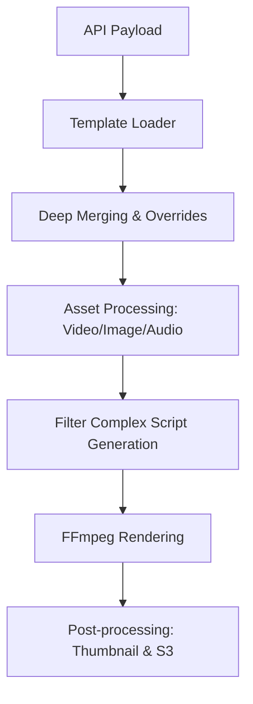

# 🏗️ Video Engine: Modern Architecture Guide

Video Engine ini dirancang dengan prinsip **"Infrastructure as Code"** untuk video. Setiap aspek visual dan audio didefinisikan dalam JSON, yang kemudian diterjemahkan menjadi rantai filter FFmpeg yang kompleks.

## 1. Alur Kerja (The Pipeline)

Proses pembuatan video mengikuti alur linear namun sangat fleksibel:

## 2. Rahasia Engine Dinamis

### 📂 Sistem Template
Template bertindak sebagai "Blueprint". Alih-alih menulis koordinat piksel setiap kali, Anda memanggil template `aesthetic_vlog` yang sudah memiliki standar resolusi, transisi, dan gaya.

### 🎭 Overrides & Variables
Engine mendukung pengalihan dinamis:
- **`template_overrides`**: Mengganti properti template (misal: ganti font atau warna secara instan).
- **`template_variables`**: Mengisi "lubang" teks di dalam desain template.

### 🎥 Abstraksi FFmpeg (Filter Complex)
Alih-alih menjalankan perintah FFmpeg yang panjang di terminal (yang sering error di Windows karena limit karakter), Engine ini menulis instruksinya ke file `filters.txt` menggunakan `-filter_complex_script`. Ini memungkinkan ribuan instruksi filter dalam satu kali render.

---

## 3. Cara Membangun Aplikasi Video Dinamis

Jika Anda ingin membangun aplikasi seperti CapCut atau Canva (SaaS), ikuti prinsip ini:

### A. Modularitas Subtitle
Pisahkan generator subtitle. Seperti yang kita implementasikan di `generateAssFile`, gunakan standar **ASS (Advanced SubStation Alpha)**. Ini jauh lebih kuat daripada SRT karena mendukung warna kustom, animasi per kata, dan posisi absolut.

### B. Scalable Audio Pipeline
Jangan hanya menggabungkan audio. Gunakan **Sidechain Compression (Audio Ducking)**. Ini adalah standar profesional di mana musik otomatis mengecil saat narasi berbunyi, membuat video terasa jauh lebih premium.

### C. Resource Management
Selalu gunakan direktori kerja (`workDir`) berbasis UUID untuk setiap job. Ini mencegah konflik file saat ribuan user melakukan render secara bersamaan.

### D. Asset Sourcing
Dukung berbagai sumber:
- **Direct URL**: Download otomatis.
- **Local Path**: Untuk aset sistem.
- **Stock Library**: Integrasi API (Pexels/Pixabay) untuk mempermudah user mencari aset.

---

## 💡 Tips untuk Masa Depan
1. **GPU Acceleration**: Gunakan `h264_nvenc` (Nvidia) atau `h264_amf` (AMD) untuk render 10x lebih cepat.
2. **Layer-based Editing**: Pikirkan video sebagai tumpukan layer (seperti Photoshop), di mana setiap layer bisa memiliki transformasinya sendiri.
3. **Real-time Preview**: Gunakan FFmpeg untuk membuat "Draft" berkualitas rendah untuk preview cepat sebelum render final.
